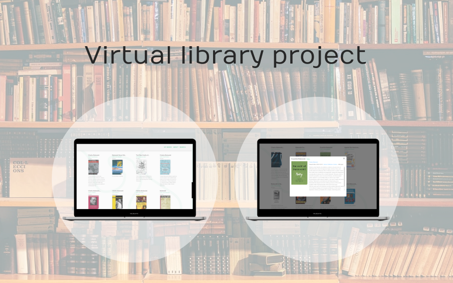
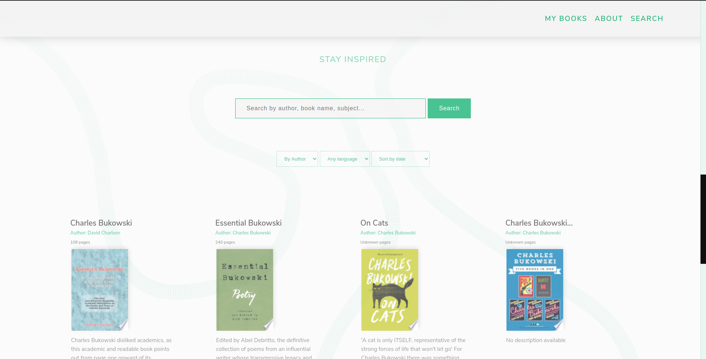

# Rosetta - Bookfinder Website / App

## About: 
1. This was a group project from **DCI's WEB Development Course**, which We attended between 2019 - 2021. 

### 🚀 Technologies used
1. The application was built using Javascript, HTML and SASS. The mainly goal was the use of APIs and DOM Manipulation.
2. This project uses *Google Books API*, *Webpack*, *Babel*, *MVC Design Pattern* 

### Credits goes to:
- Bido: https://github.com/bidodev
- Zakaria: https://github.com/ZakariaHn
- Melissa: https://github.com/nadiamariduena

#### Live Version
* <a href="https://bidodev.github.io/rosetta-application" alt="deployed-version" target="_blank">Deployed Version</a>

#### Documentation
* <a href="https://github.com/bidodev/rosetta-application/tree/master/docs" alt="instagram-lookalike" target="_blank">API Queries</a>

## Images Preview
### A Search by Author

### Filters Options

### Modal preview of a book.

